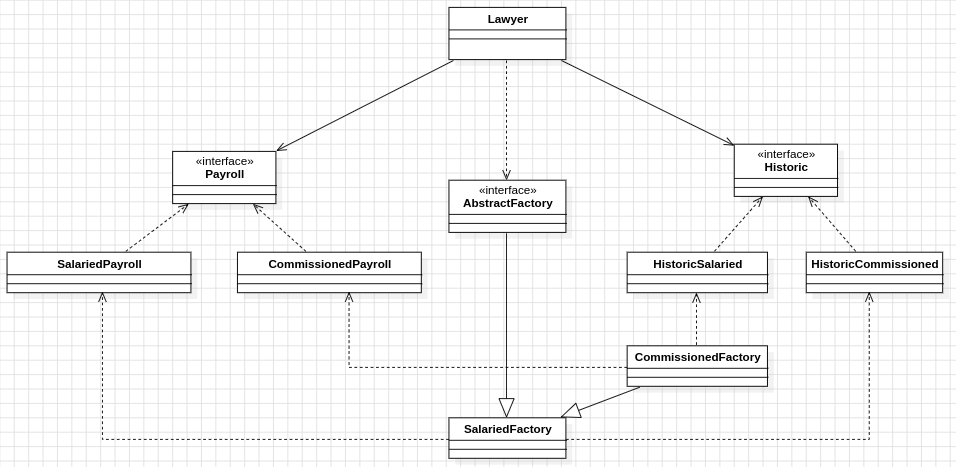

<h1>
    
    DESIGN PATTERN: ABSTRACT FACTORY
</h1>
This repository contains a detailed case study on the Abstract Factory design pattern. The Abstract Factory pattern is one of the most important and widely used design patterns in software development. It provides an interface for creating families of related or dependent objects without specifying their concrete classes.

<h2>
    
    About project
</h2>

<p>To exemplify this design pattern, a project representing a part of the business logic of a law firm management system was used. In this system, there are salaried and commissioned lawyers. This part of the system represents the functionality that issues the salary and history of these lawyers.
</p>

<h2>
    
    Class diagram
</h2>

<p align="center">
 
</p>

# Project structure

```
- 📁 src
  - 📁 main
    - 📁 java
      - 📁 com
        - 📁 example
          - 📁 implementations
            - 📄 CommissionedFactory.java
            - 📄 CommissionedPayroll.java
            - 📄 HistoricComissioned.java
            - 📄 HistoricSalaried.java
            - 📄 Lawyer.java
            - 📄 SalariedFactory.java
            - 📄 SalariedPayroll.java
        - 📁 interfaces
           - 📄 AbstractFactory.js
           - 📄 Historic.js
           - 📄 Payroll.js
        - 📁 resources
  - 📁 test
    - 📁 java
      - 📁 factoryTests
          - 📄 FactoryTests.java

```
